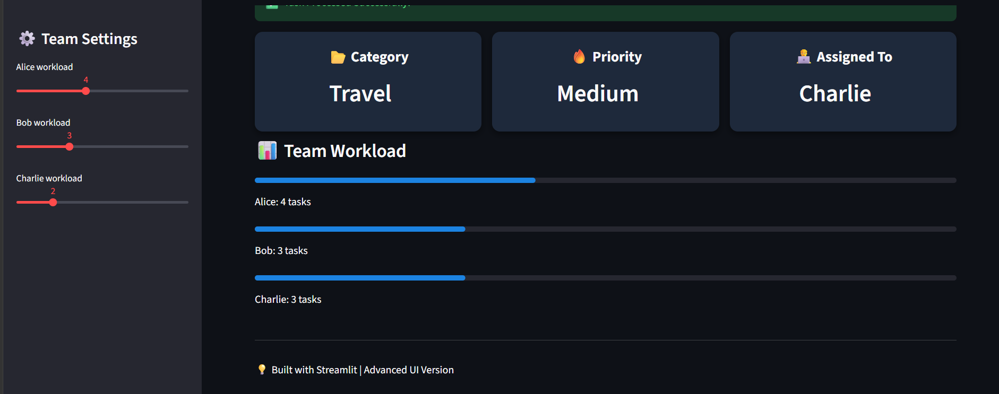
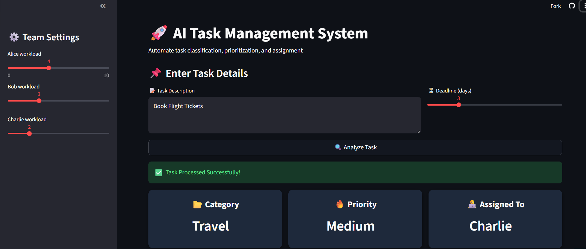
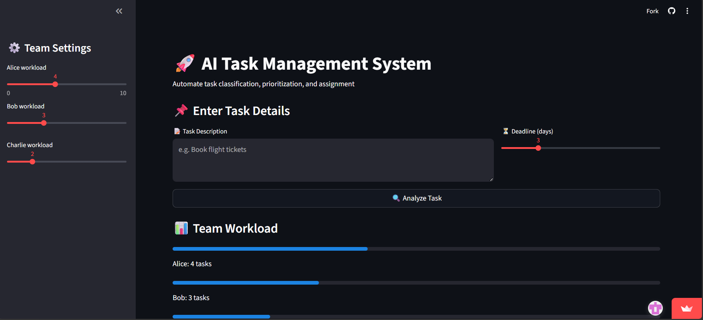

# AI Powered Task Management System

## 🚀 Live Demo
Streamlit App: https://ai-task-management-system-hqf5fmzvtdpha8dyh2vmhn.streamlit.app/
## 📌 Project Overview
AI Powered Task Management System is a Machine Learning based web application that helps users manage and prioritize tasks intelligently. The system predicts task categories and priorities using trained ML models and provides an interactive web interface using Streamlit.

## ✨ Features
- Smart Task Prediction
- AI-based Priority Detection
- User Friendly Interface
- Machine Learning Integration
- Real-time Predictions
- Streamlit Web Application

## 🛠️ Tech Stack
- Python
- Streamlit
- Scikit-learn
- XGBoost
- Pandas
- NumPy
- Joblib

## 📂 Dataset
Dataset Link (Google Drive): https://drive.google.com/file/d/1wd8_4-NglkuWItDjRKDalJ2QuetxEE9u/view?usp=drive_link

## 🤖 Machine Learning Models
Included model files:
- task_model.pkl
- tfidf.pkl
- model.pkl
- final_model.pkl
- nb_model.pkl
- svm_model.pkl

Note: `priority_model.pkl` is not included because of its very large file size.

## ▶️ Run Locally

Go to project directory:

```bash
cd AI-Task-Management-System
```

Install dependencies:

```bash
pip install -r requirements.txt
```

Run the Streamlit app:

```bash
streamlit run app.py
```
## 📸 Project Screenshot






👨‍💻 Author

Krishna Gupta
GitHub: https://github.com/krishnag5465

📬 Contact

For any queries or collaboration opportunities, feel free to connect.


